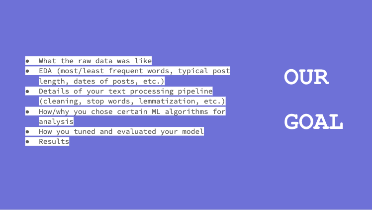
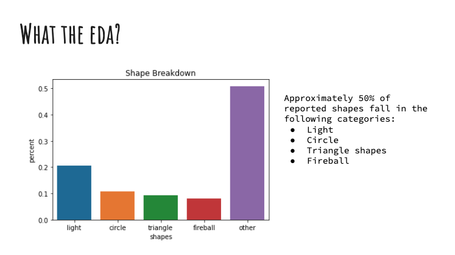
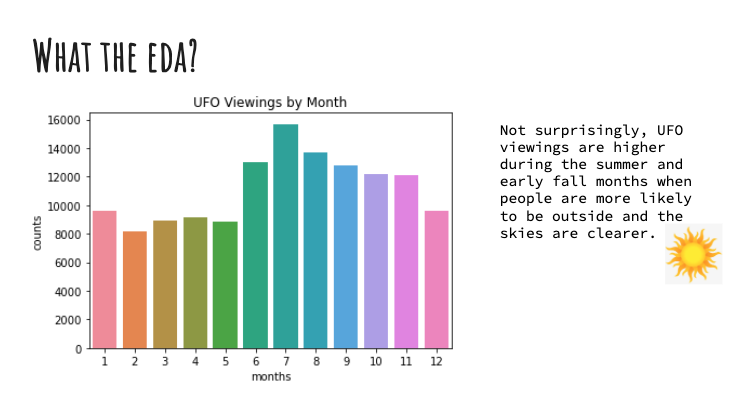
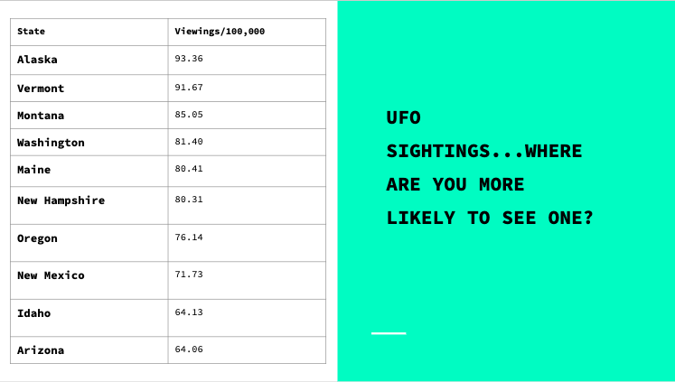
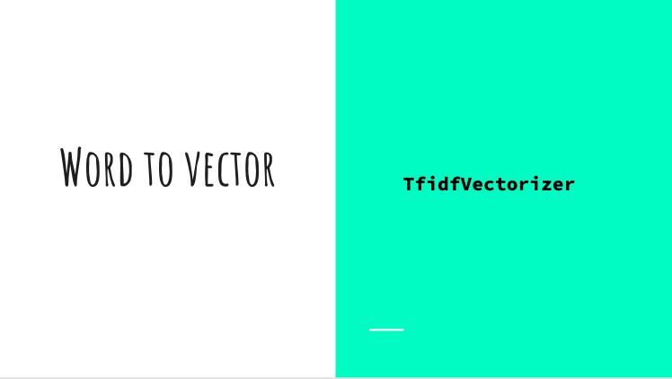
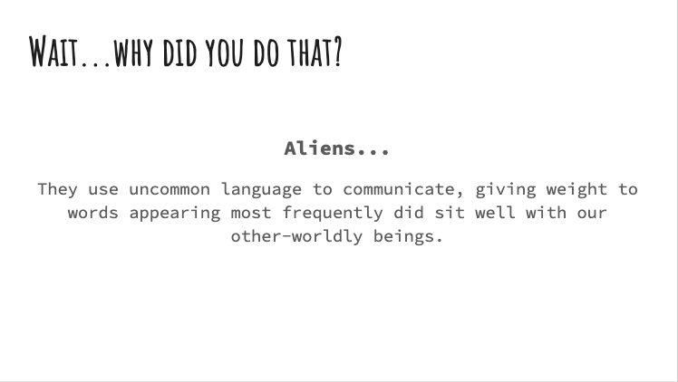
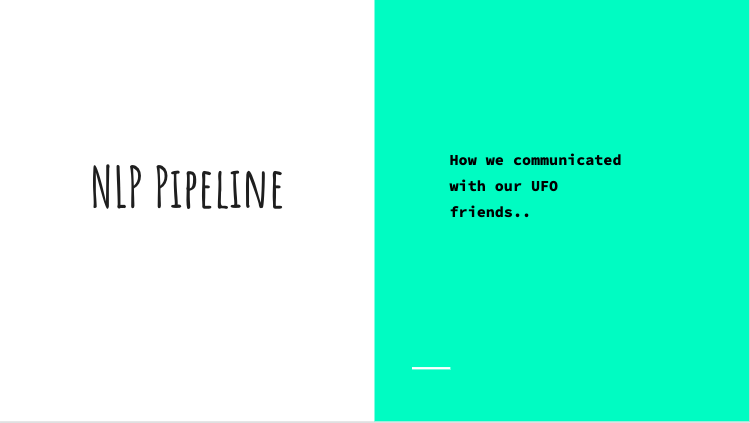
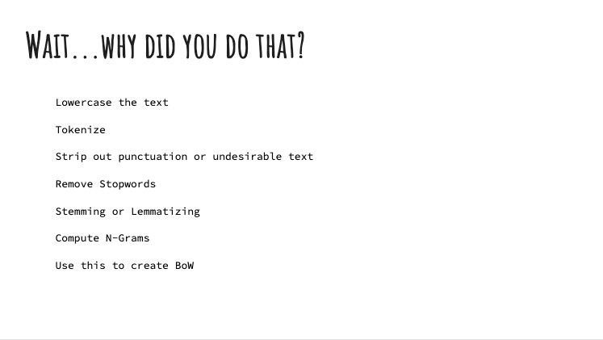
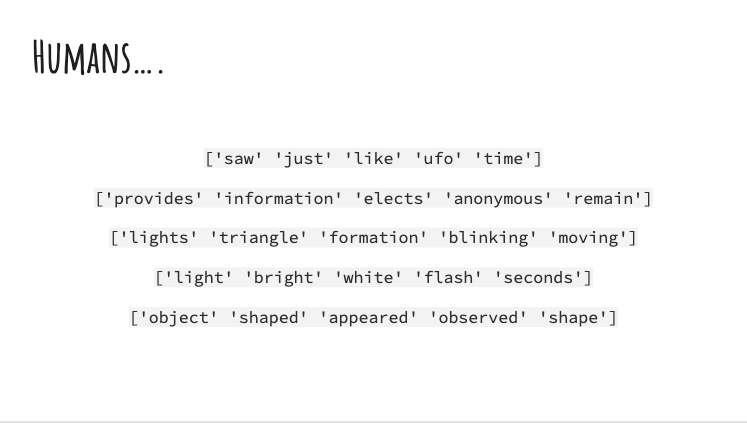
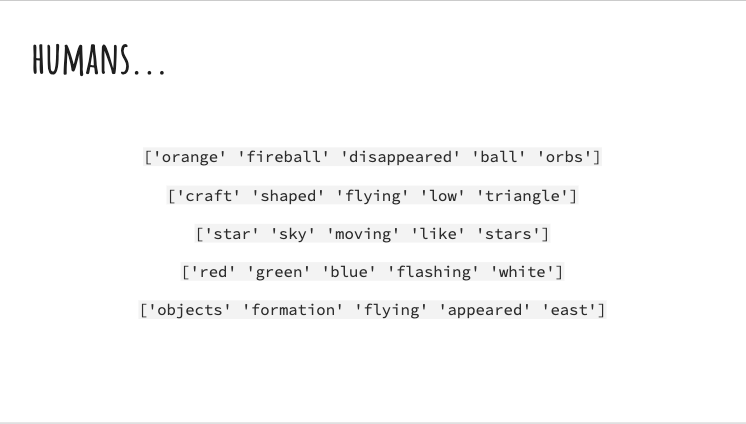

# Summary
Working with a unique dataset such as UFO sightings, we find that higher weight is placed on words describing the event than words expressing the persons experience. 

### Goal

* EDA (most/least frequent words, typical post length, dates of posts, etc.)
* Details of your text processing pipeline (cleaning, stop words, lemmatization, etc.)
* NLP Pipline
* Word to Vector
* Top Features
* Results

