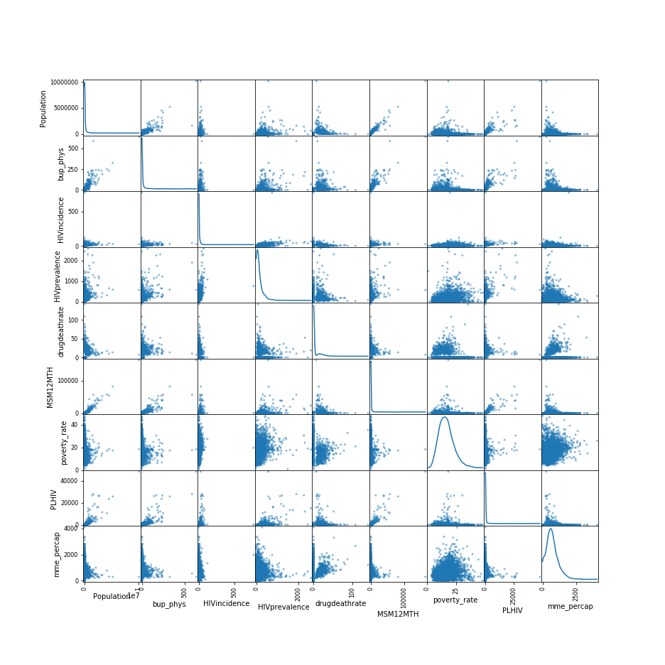
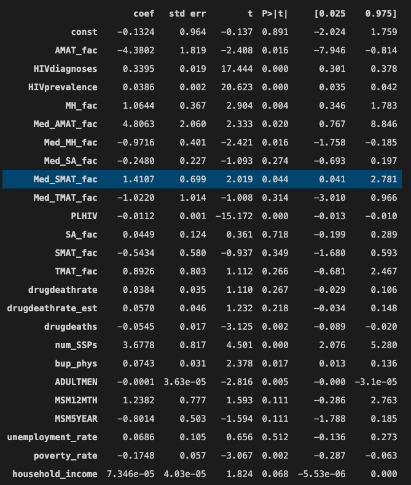
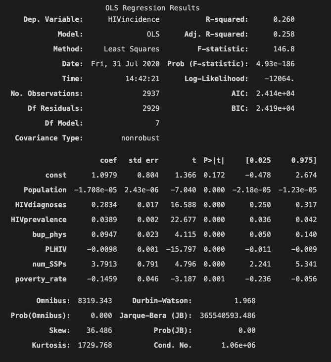
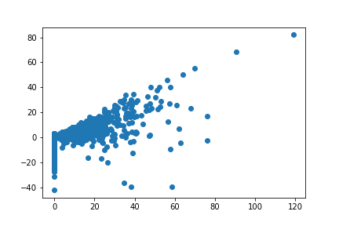
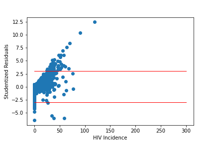

# Summary

#### Goal
Analyze HIV across the US and develop a predictive model to predict HIV incidence for US counties.

#### Team Structure

**Members**
Anne, Anees, & Lester. 

**Workflow**
We decided to work out of a central github repository from one team member, working from our remote version, and pushing changes as need. 

**Task**
EDA - Anees

Features Identification - Lester

Model Testing & Performance - Anne

# Data

**EDA approach**
- identified features that reflected collinearity characterstics and compared to p-values in OLS

**Selection Features**
- Threw in 29 features to see how the regression model did and adjust based on reverse stepwise method. 
- Removed all features that had highest p-value, started by removing highest p-value, then top 2 highest then made decision to remove half of features with p-value higher than .05. 
- We originally removed Population because of it's high p-value but decided to add it back in because we brainstormed that adultmen and population probably have collinear relaitonship but population might have a higher relationship. 
- Adding population and adultmen back into the OLS model pushed our p-value for population to .89 and ADULTMEN to .3

**Model Testing & Performance**
Our baseline meanregressor was: -0.0009622942019451575

Our first model returned a cross validation score of .07, which was much lower than we expected.
After reviewing some of our features, we removed a very small county that was an outlier and skewing our model.
This improved our CV score to .48. 

The cross validation score with 5 folds is 0.4855860906720511.
The cross validation score for the baseline with 5 folds is 0.4855860906720511.

